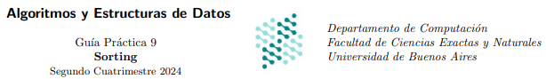
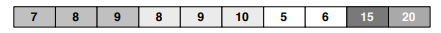
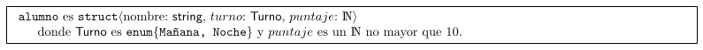
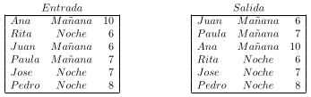

<p align="center">
  
</p>

<br>
<br>

<!--

# Sorting 
### Guia 8 
-->


**Ejercicio 1**. Comparar la complejidad de los algoritmos de ordenamiento dados en la teorica
para el caso en que el arreglo a ordenar se encuentre perfectamente ordenado de manera
inversa a la deseada.

<details><summary><b>💡 solucion</b></summary>
<hr>

Habria que usar un algoritmo __no-estable__, con la menor complejidad posible.
Se podria usar Quick-Sort por que es no-estable y su complejidad es O(n*n) en el peor caso.
Pero como sabemos que estan ordenados de forma inversa, podemos saber donde esta la mediana,
por ende la complejidad cambia a su mejor caso que es O(n log n)

<hr>
</details>

**Ejercicio 2**. Defina la propiedad de estabilidad en un algoritmo de ordenamiento. Explique por que 
que el algoritmo de heapSort no es estable

<details><summary><b>💡 solucion</b></summary>
<hr>

La estabilidad en los algoritmos de ordenamiento significa que, cuando se aplica el algoritmo, 
dos elementos con el mismo valor mantienen su orden relativo en la secuencia. Esto es útil en 
la práctica para realizar ordenamientos con múltiples criterios sin perder el orden previamente establecido.

Por ejemplo, es posible ordenar una lista primero por un criterio secundario y luego
por un criterio principal. Gracias a la estabilidad, el orden final reflejará 
ambos criterios: el principal, y en caso de empate, el secundario. En cambio, si el algoritmo no es estable,
el ordenamiento previo podría perderse, dejando solo el orden del último criterio aplicado.

El heap mantiene el min o max en el tope, al reconstruir el heap podria perderse el orden relativo
de los elementos.

<hr>
</details>


**Ejercicio 3**. Imagine secuencias de naturales de la forma `s = Concatenar(s′, s′′)`, donde `s′` 
es una secuencia ordenada de naturales y  `s´´` es una secuencia de naturales elegidos al azar. 
¿Que metodo utilizarıa para ordenar s? 
Justificar. (Entiendase ques se encuentra ordenada de la manera deseada.)

<details><summary><b>💡 solucion</b></summary>
<hr>

Uso MergeSort con una complejidad O(n log n), porque al estar ordenada s' nose
realiza ninguna operacion adicional, y se ordena s'' y luego se hace un merge (se concatena) con s'. 


__Complejidad__: `O(n^2)`

<hr>
</details>


**Ejercicio 4**. Escribir un algoritmo que encuentre los k elementos mas chicos de un arreglo de dimension n, donde k ≤ n.
¿Cual es su complejidad temporal? ¿A partir de que valor de k es ventajoso ordenar el arreglo entero primero?

<details><summary><b>💡 solucion</b></summary>
<hr>

```
encontrar_kelems_MasChivos(in s: int, k: int)
   // varias opciones
   array_ordenado = mergeSort(s) 
   // array_ordenado = heapSort(s)

   res = new Array(k)
   for(int i=0, i<k, i++)
       res[i] = array_ordenado[i]
   end for
   return res

```

sea __m__ la complejidad del algoritmo de ordenamiento elegido

__Complejidad__: O(k) + O(m)  = O(k) + O(n log n) = O (k + n log n) 

como el loop es O(k), para k >= n/2 ,resulta mas ventajoso, si k fuese n entonces la complejidad :
O(n) + O(n log n) = O (n log n)`

<hr>
</details>


**Ejercicio 5**. Se tiene un conjunto de n secuencias {s1, s2, . . . , sn} en donde cada $s_{i}$ (1 ≤ i ≤ n) es una secuencia ordenada de naturales. ¿Que metodo utilizaria para obtener un arreglo que contenga todos los elementos de la union de los $s_{i}$ ordenados.Describirlo. Justificar.

<details><summary><b>💡 solucion</b></summary>
<hr>

Como cada $s_{i}$ esta ordenado sabemos $s_{i}[0]$ seran los elementos mas chicos
y los siguiente $s_{i}[1]$ asi hasta $s_{i}[n]$

1. Sacamos el primer elemento de $s_{i}$ y lo insertamos en un min-heap
2. Sacamos el minimo del min-heap
3. Insertamos la siguiente ronda de $s_{i}$ en el min-heap
4. Sacamos el minimo del min-heap y repetimos hasta que el min heap quede vacio

<hr>
</details>


**Ejercicio 6**. Se tiene un arreglo de n numeros naturales que se quiere ordenar por frecuencia, y en caso de igual frecuencia, por su valor. Por ejemplo, a partir del arreglo [1, 3, 1, 7, 2, 7, 1, 7, 3] se quiere obtener [1, 1, 1, 7, 7, 7, 3, 3, 2]. Describa un algoritmo que realice el ordenamiento descripto, utilizando las estructuras de datos intermedias que considere necesarias.
Calcule el orden de complejidad temporal del algoritmo propuesto.

<details><summary><b>💡 solucion</b></summary>
<hr>

__OrdenarPorFrecuencia__:

0. creo un diccionario res = dictAVL<valor, frecuencia>   // O(1)
1. recorro toda el array de entrada, en cada iteracion pregunto: // O(n log n)
     - si valor __esta__ en res, incremento su `frecuencia`             // O(log n)
     - si valor __no esta__ en res, lo defino con `frecuencia = 0`      // O(log n)
2. con un iterador, itero y convierto el res en un array de tuplas    // O(n log n)
3. Ordeno por segunda componente con mergeSort // O(n log n)
4. Ordeno por primera componente con mergeSort // O(n log n)  

__complejidad__: O(nlog n)

**nota**: No se puede usar counting sort , pues cada elem en principio no esta acotado.
usar counting-sort resultaria en crear un array de n posiciones.

<hr>
</details>


**Ejercicio 7**. Sea $A[1 . . . n]$ un arreglo que contiene n numeros naturales. Diremos que un rango de posiciones $[i . . . j]$, con $1 ≤ i ≤ j ≤ n$, contiene una escalera en A si valen las siguientes dos propiedades:
1. $(\forall k : N)(i ≤ k < j) \rightarrow (A[k + 1] = A[k] + 1)$ (esto es, los elementos no s´olo est´an ordenados en forma creciente, sino que ademas el siguiente vale exactamente uno m´as que el anterior).
2. Si $1 < i$ entonces $A[i] \neq A[i − 1] + 1$ y si $j < n$ entonces $A[j + 1] \neq A[j] + 1$ (la propiedad es maximal, es decir que el rango no puede extenderse sin que deje de ser una escalera seg´un el punto anterior).

Se puede verificar facilmente que cualquier arreglo puede ser descompuesto de manera unica como una secuencia de escaleras. Se pide escribir un algoritmo para reposicionar las escaleras del arreglo original, de modo que las mismas se presenten en orden decreciente de longitud y, para las de la misma longitud, se presenten ordenadas en forma creciente por el primer valor de la escalera

El resultado debe ser del mismo tipo de datos que el arreglo original. Calcule la complejidad temporal de la solucion propuesta, y justifique dicho calculo.

Por ejemplo, el siguiente arreglo

<p align="center">
  
</p>

deberia ser transformado a

<p align="center">
  
</p>

*Ayuda*: se aconseja comenzar el ejercicio con una clara descripci´on en castellano de la estrategia que propone para resolver
el problema.


<details><summary><b>💡 solucion</b></summary>
<hr>


__Algoritmo__:

0. creo un array de tuplas <primerValor, largoEscalera> , 
  el tamaño de dicho array en la cantidad de Escalera
1. iterar sobre el array de entrada
   - si es otra escalera:
     - agrego al array de tuplas <primerValor, largoEscalera>
     - actualizo primerValor, seteo largoEscalera = 0
   - si no es otra escalera:
     - incremento largoEscalera
2. ordenar con mergeSort() por primera componente
3. ordenar con mergeSort() por segunda componente
4. Crear un arreglo res con el mismo tamaño que el arreglo original 
5. Para cada tupla (primerValor, largoEscalera) en el arreglo ordenado escaleras:
   - Se asignan los valores de la escalera en el arreglo res, 
    empezando desde la posición indicada por el primerValor, y rellenando hasta el final
    de la escalera (según el largoEscalera).
         

__Complejidad__ = O(n log n)

```
OrdenarPorFrecuencia(in a: array<int>)

  // armar tuplas  O(n)

  arrEscaleras = new array( cantidadEscaleras() )  // 0(1) + O(n)
  primero = a[0], largo = 0
  k=0

  for (i=0; i < a.size; i++ )      // O(n)
    if a[i+1] == a[i]+1 
      largo ++
    else                         // O(1)
      arrEscaleras[k]= (primero, largo)  
      primero = a[largo+1]
      largo=0
      k++
  endfor    

  // ordenar tuplas  O(nlog n)
 
  mergeSort(arrEscaleras) // por primer componente     // O(n log n)
  mergeSort(arrEscaleras) // por segunda coomponente   // O(n log n)

  // recontruir array original ordenado     O(n)

  res = new array(a.size)
  indice = 0
  for (primero, largo) in  arrEscaleras           
    i = 0
    while i < largo                              
      res[indice] = primero + i
      i ++
      indice ++
    endwhile
  return res
```


__Porque reconstruir el array ordenado es O(n)__

Hay dos casos:
1. en el peor caso hay n escaleras lo que implica que el largo de cada escalera es 1
entonces el loop exterior es O(n) y el interior es O(1).
2. en el peor caso el largo de la escalera es n, lo que implica que hay solo una escalera.
entonces el loop exterior es O(1) y el interior es O(n)


__NOTA__: como la complejidad de mergeSort es (n log n), podria usar listaEnlazada o DicLOG en
lugar de arrays por todos lados.

<hr>
</details>


**Ejercicio 8**. Suponga que su objetivo es ordenar arreglos de naturales (sobre los que no se conoce nada en especial), y que cuenta con una implementacion de arboles AVL. ¿Se le ocurre alguna forma de aprovecharla? Conciba un algoritmo que llamaremos AVL Sort. ¿Cual es el mejor orden de complejidad que puede lograr?

*Ayuda*: deberia hallar un algoritmo que requiera tiempo O(n log d) en peor caso, donde n es la cantidad de elementos a ordenar y d es la cantidad de elementos distintos. Para inspirarse, piense en Heap Sort (no en los detalles puntuales, sino en la idea general de este ultimo).
Justifique por que su algoritmo cumple con lo pedido.


<details><summary><b>💡 solucion</b></summary>
<hr>

__ALGORITMO__
```
AVLsort(int A: array<int>)
  Avl = new avl()      // O(1)
  for i=0 ...Tam(A)     // O(n)
    Avl.agregar(A[i]) // (log n)
  endfor
  res= Avl.inorderAVL() // O(n)
  return res 
```

__Complejidad__: O(n log n)  
<hr>
</details>


**Ejercicio 9**. Se tienen dos arreglos de numeros naturales, `A[1..n]` y `B[1..m]`. Nada en especial se sabe de B, pero A tiene `n′` secuencias de numeros repetidos continuos (por ejemplo `A = [3333311118888877771145555], n′ = 7`). Se sabe ademas que `n′`es mucho mas chico que `n`. Se desea obtener un arreglo C de tamaño `n + m` que contenga los elementos de A y B, ordenados.

1. Escriba un algoritmo para obtener C que tenga complejidad temporal `O(n + ( n′ + m ) log(n′ + m))` en el peor caso.
Justifique la complejidad de su algoritmo.

2. Suponiendo que todos los elementos de B se encuentran en A, escriba un algoritmo para obtener C que tenga complejidad temporal `O(n + n′(log(n′) + m))` en el peor caso y que utilice solamente arreglos como estructuras auxiliares.
Justifique la complejidad de su algoritmo.

<details><summary><b>💊 solucion</b></summary>

```

new d = new dictLog<valor, longitud> // O(1)


rep = 0
for i=1 ... tam(A)  // O(n)
  if A[i-1] != A[i]
    rep ++
  else
    definirRapido(d,A[i-1], rep) 
    rep = 0
end for

for i=1 ... tam(B)  // O(n)
  if B[i-1] != B[i]
    rep ++
  else
    definirRapido(d,B[i-1], rep) 
    rep = 0
end for


1.

def merge_arrays(A, B):
    # Paso 1: Agrupar secuencias de A
    agrupadas_A = []
    start = 0
    for i in range(1, len(A)):
        if A[i] != A[start]:
            agrupadas_A.append((A[start], i - start))  # (valor, longitud)
            start = i
    agrupadas_A.append((A[start], len(A) - start))  # Última secuencia

    # Paso 2: Construir un arreglo temporal con las secuencias agrupadas y B
    temporal = [val for val, _ in agrupadas_A] + B

    # Paso 3: Ordenar el arreglo temporal
    temporal.sort()

    # Paso 4: Reconstruir el arreglo C ordenado
    C = []
    for val, count in agrupadas_A:
        C.extend([val] * count)  # Expandir las secuencias originales de A
    C.extend(B)
    C.sort()
    return C
```


</details>


**Ejercicio 10**. Considere la siguiente estructura para guardar las notas de un alumno de un curso:


<p align="center">
  
</p>

Se necesita ordenar un arreglo de alumnos de forma tal que todes les alumnes de la mañana aparezcan al inicio de la tabla según un orden creciente de notas y todos los de la noche aparezcan al final de la tabla también ordenados de manera creciente respecto de su puntaje, como muestra en el siguiente ejemplo:

<p align="center">
  
</p>


1. Proponer un algoritmo de ordenamiento proc ordenaPlanilla(inout p : Array⟨alumno⟩) para resolver el problema descripto anteriormente y cuya complejidad temporal sea O(n) en el peor caso, donde n es la cantidad de elementos del arreglo. Justificar.


2. Modificar la solución del inciso anterior para funcionar en el caso que Turno sea un tipo enumerado con más elementos (donde la cantidad de los mismos sigue estando acotada y el órden final está dado por el órden de los valores en el enum. Puedo hacer for t in Turno).

3. ¿La cota O(n) contradice el “lower bound” sobre la complejidad temporal en el peor caso de los algoritmos de ordenamiento? (El Teorema de “lower bound” establece que todo algoritmo general de ordenamiento tiene complejidad temporal Ω(n log n).) Explique su respuesta.


<details>
<summary><b>💡 solucion</b></summary>
<hr>

__Algoritmo__

```
ordenar = new array(p.size)

mitad = 0
for i...tam(p)     // O(n)

  if p[i].turno == mañana
    ordenar[i] = p[i]
    mitad = i  
  else
    ordenar[tam(p)-i] = p[i] 
endfor

mañana = new array(mitad)
noche = new array(tam(p)-mitad)

for i...tam(mañana)
  mañana[i] = ordenar[i]
endfor
 
for i...tam(noche)
  noche[i] = ordenar[mitad+i]
endfor

countingSort(tarde, 11)         // O(n)
countingSort(noche, 11)         // O(n) 

for i ....tam(tarde):
    p[i] = tarde[i]

for i ...tam(noche):
  p[tam(tarde) + i] = noche[i]

```
__Complejidad__: O(n)


__Algorirmo 2__

```

proc ordernarPlantilla(inout a: plantilla)

 // devuelve un array de listaEnlazadas ordenas (no concatena al final) 
 // O(n + 11)
 aux = bucketSort(a, 11) 

 noche  = new listaEnlazada<alumno>    // O(1)
 mañana = new listaEnlazada<alumno>    // O(1)
 
 i, j = 0
 while i < aux.size do                 // O(n)
   aux[i].iterador()
   while(it.haySiguiente) do
     alumno = it.sig
     if(alumno == "mañana") do
      mañana.agregarAtras(alumno)
     else
      noche.agregar(alumno)
     endif
   endwhile
   i++
 endwhile

 noche.concatenar(mañana)              // O(1)
 it = noche.iterador()

 while(it.haySiguiente)do              // O(n)
  a[i] = it.sig
  i++
 endwhile

 return a
      

```
__Complejidad__: O(n)

<hr>
</details>

**Ejercicio 11**. Sea A[1 . . . n] un arreglo de números naturales en rango (cada elemento está en el rango de 1 a k, siendo k alguna constante). Diseñe un algoritmo que ordene esta clase de arreglos en tiempo O(n). Demuestre que la cota temporal es correcta

<details><summary><b>💡 solucion</b></summary>
<hr>


```
proc ordenarNelemEnRangoK(inout a: array, in k: int)
  res = countingSort(a) // O(n+k) , 
  return res

proc ordenar(inout a: array)
  k = 0
  i = 0
  while (i < a.size) {
    if(a[i] > k )
     k =a[i]
    i++ 
  }

  res = countingSort(a,k)
  return

```  
<hr>
</details>


**Ejercicio 12**. Se desea ordenar los datos generados por un sensor industrial que monitorea la presencia de una sustancia
en un proceso quı́mico. Cada una de estas mediciones es un número entero positivo. Dada la naturaleza del proceso se sabe
que, dada una secuencia de n mediciones, a lo sumo  $\sqrt{|n|}$ valores están fuera del rango [20, 40].
Proponer un algoritmo O(n) que permita ordenar ascendentemente una secuencia de mediciones y justificar la complejidad
del algoritmo propuesto.


<details><summary><b>💡 solucion</b></summary>
<hr>

``` 
proc ordernar(inout a: array)

  inRange  = new listaEnlazada()
  outRange = new listaEnlazada()

  for i...tam(a)
   if a[i] >= 20 or a[i]<= 40
     inRange.agregarAtras(a[i])
   else
     outRange.agregarAtras(a[i])   
   endif
  forend

  //  inRange.size       n
  //  outRange.size      √n

  countingSort(inRange, 40) // O(n)
  selectionSort(outRange)   // O( (√n)² ) = O(n)  

  a = concat(inRange,outRange)
```  
<hr>
</details>


**Ejercicio 13**. Se tiene un arreglo A[1 . . . n] de T , donde T son tuplas ⟨c1 : N × c2 : string[ℓ]⟩ y los string[ℓ] son strings
de longitud máxima ℓ. Si bien la comparación de dos N toma O(1), la comparación de dos string[ℓ] toma O(ℓ). Se desea
ordenar A en base a la segunda componente y luego la primera.
1. Escriba un algoritmo que tenga complejidad temporal O(nℓ + n log(n)) en el peor caso. Justifique la complejidad de su
algoritmo.
2. Suponiendo que los naturales de la primer componente están acotados, adapte su algoritmo para que tenga complejidad
temporal O(nℓ) en el peor caso. Justifique la complejidad de su algoritmo.


<details><summary><b>💡 solucion 1</b></summary>

```

ℓ = esta acotada pues hay una cantidad finita de char, en ascii es 255, si fueran palabras seria 27 letras
Si agrego a un trie O(nℓ), puedo usar un inorder para obtener un orden lexitografico en O(n).


proc ordenar (inout A: array<T>)

 d = new dicDig()

 for i...tam(A)        // O(nℓ)
   d.definir( A[i].c2, A[i])
 end for  

 A = d.inOrder(t)     // O(n)      por segunda coordenada
 
 heapSort(A)          // O(nlog n) por primera coordenada

return 

```

</details>

<details><summary><b>💡 solucion 2</b></summary>

```

proc ordenar (inout A: array<T>)

  d = new dicDig()

  for i...tam(A)        // O(nℓ)
   d.definir( A[i].c2, A[i])
  end for  

  A = t.inOrder(t)     // O(n)      por segunda coordenada
 
  // Los naturales esta acotados a k

  countingSort(A)       // O(n+k)  por primera coordenada

return 

```

</details>


**Ejercicio 14**. Se tiene un arreglo A de n numeros naturales y un entero k. Se desea obtener un arreglo B ordenado de
n × k naturales que contenga los elementos de A multiplicados por cada entero entre 1 y k, es decir, para cada 1 ≤ i ≤ n y
1 ≤ j ≤ k se debe incluir en la salida el elemento j × A[i]. Notar que podria haber repeticiones en la entrada y en la salida.

a) Implementar la funcion

```
proc ordenarMultiplos(in A : Array⟨N⟩, ∈ k : N) : Array⟨N⟩

```

que resuelve el problema planteado. La funcion debe ser de tiempo O(nk log n), donde n es el tamaño del arreglo.

b) Calcular y justificar la complejidad del algoritmo propuesto.


<details><summary><b>💡 solucion (revisar)</b></summary>

```
proc lista(in k: int, in e: in): array<int>
 res = new listaEnlazada
 for i...k
   res.agregarAtras(e.k) 
 endfor

 return res

proc ordenarMultiplos(in A : Array⟨N⟩, ∈ k : N) : Array⟨N⟩
 
 countingSort(A)

 elems = lista(k, A[0])  // O(k)

 for i=1...tam(A)    // O(nk)
  if(A[i] != A[i-1])
    elems.agregarAtras( lista(k, A[i]) ) // O(1)
  endif  
 endfor

 B = elem.size
 i = elem.iterador
 
 i = 0
 while it.haySig
  B[i] = it.sig
  i++
 endwhile

 radixSort(B)  // O(nk log(Max B)) = O(nk log n)  
 
 // nota: Max B = n ???

 return B
```

__Complejidad__: O(k + n + nk log(n) )

</details>

**Ejercicio 15**. Se tiene un arreglo A de n numeros naturales. Sea m := max{A[i] : 1 ≤ i ≤ n} el maximo del arreglo. Se
desea dar un algoritmo que ordene el arreglo en O(n log m), utilizando unicamente arreglos y variables ordinarias (i.e., sin
utilizar listas enlazadas, arboles u otras estructuras con punteros).

a) Implementar la funcion

proc raroSort (in A: Array⟨N⟩) : Bool {
  que resuelve el problema planteado. La funcion debe ser de tiempo O(n log m), donde n es el tamaño del arreglo y
  m = max{A[i] : 1 ≤ i ≤ n
}.

b) Calcular y justificar la complejidad del algoritmo propuesto


<details><summary><b>💡 solucion</b></summary>

```
  proc raroSort (in A: Array⟨N⟩) : Bool
   // radixSort con bucketSort
   
   m = 0
   for i...tam(A)
     if A[i] > A[i-1]
      m = A[i]
   endfor
   d = cantidadDigitos(m)
   
   // usa Bucket Sort
   res = radixSort(A, d)          // O (n log (max A)) = O(n log m)
   
   return res

```

</details>


**Ejercicio 16**. Arreglos de enteros.
1. Dar un algoritmo que ordene un arreglo de n enteros positivos menores que n en tiempo O(n).
2. Dar un algoritmo que ordene un arreglo de n enteros positivos menores que $n^2$ en tiempo O(n). Pista: Usar varias llamadas al item anterior.
3. Dar un algoritmo que ordene un arreglo de n enteros positivos menores que $n^k$ para una constante arbitraria pero fija k.
4. ¿Que complejidad se obtiene si se generaliza la idea para arreglos de enteros no acotados?

<details><summary><b>💡 solucion</b></summary>

```

/*--- Item 1 ---*/

proc ordenarN( inout A: array⟨int⟩ )
  k = A.size
  countingSort(A, k)

/*--- Item 2 ---*/

proc ordenarB( inout A: array⟨int⟩ )

  B = new listaEnlazada()
  C = new listaEnlazada()  

  for i...tam(A)            // O(n)
    while A[i] < n
     B.agregarAtras(A[i])
    else
     C.agregarAtras(A[i]) 
    endif 
  endfor   

  ordenarN(B)
  ordenarN(C)

  res = concat(B,C)  

  return res

```

__Visto en Clase Practica__:


```

/*--- Item 2 ---*/

proc OrdenarMenoresaM(in A: array<int>)
   B = listaVacia
   for i=0...tam(A)
     B.agregarAtras(<A[i] div n, B[i]mod n>)
   endfor

   B = menoresQueN(B)
   B = memoresQueN(B)

   res = []
   
   for i=0....tam(B):
     res.agregarAtras(B[i]_0 + B[i]_1)
   endfor

   return res


/*--- Item 3 ---*/

proc ordenarMenoresN^k(in A: array<int>, in k: int)

   B = arrayVacio(tam n)
   for i=0....tam(A)
      for j=0...k-1
         B[i]_j = (A[i] div n^j) mod n^j
      endfor
   endfor
   for i=0...k-1
     menoresQueN(B)      
   endfor
   
   recontruir(B) // O(n.k)


```

</details>


**Ejercicio 17**.Se nos pide ayudar a un herborista que quiere poder organizar sus ingredientes para determinar que hierbas le
conviene recolectar. Para ello cuenta con su propio inventario. Como no es una persona muy organizada, puede tener distintas
hierbas del mismo tipo en distintas alacenas o cofres. Luego de realizar una inspeccion de su lugar de trabajo, nos entrega
una secuencia de n tuplas que constan de una hierba, identificada por su nombre, y la cantidad que se encontro. El nombre de cada hierba tiene como maximo 100 caracteres, de acuerdo al estandar de la Organizacion Mundial de Herboristas. El herborista cuenta a su vez con su libro de creaciones, que le permite saber en cuantas recetas se utiliza cada hierba.

Se necesita saber cuales son las hierbas que se usan en mas creaciones y, en caso de empate, deberian aparecer primero
aquellos de las que tiene menos reservas. La complejidad esperada en el peor caso es de O(n + h log(h)), donde h es la
cantidad de hierbas distintas con las que cuenta el herborista.

`proc Recolectar(in s:Vector<tupla<string,int>>, in u:Diccionario<string,int>):Vector<string>` 

Ejemplo: 

```
  stock = [ ("Diente de Leon", 10), ("Menta", 4), ("Margarita", 13), ("Lavanda", 12), ("Diente de Leon", 5), ("Margarita", 6) ]
  usos = {"Diente de Leon": 5, "Menta": 1, "Margarita": 3, "Lavanda": 5}
  Recolectar(stock, usos) = ["Lavanda", "Diente de Le´on", "Margarita", "Menta"]
```

Los primeros son la lavanda y el diente de leon porque ambos tiene 5 usos, pero aparece primera la lavanda porque hay
menos stock. En tercer lugar tenemos la margarita que tiene 3 usos. Finalmente, en ultimo lugar esta la menta, que tiene un
solo uso.

a) Se pide escribir el algoritmo de Recolectar. Justificar detalladamente la complejidad y escribir todas las suposiciones
sobre las implementaciones de las estructuras usadas, entre otras.

b) ¿Cual seria el mejor caso para este problema? ¿Cu´al seria la cota de complejidad m´as ajustada?

<details><summary><b>💡 solucion</b></summary>

```

proc Recolectar(in s:Vector<tupla<string,int>>, in u:Diccionario<string,int>):Vector<string>
   
/*  COMPLETO d con STOCK
  ---------------------------------------------------
  sea n la cantidad de tuplas:
  - hierba esta acotada por max 100 chars
  - cada valor de d es <stock, uso=0>
  - cada clave de d es hierba
  - iterar sobre s es O(n)  
  - cada iteracion me cuesta O(1) pues d es un trie
  - sumo todos los stock de la misma hierba 
  ---------------------------------------------------
*/

   d = new DictDig()

   for i...tam(s)

       hierba = s[i]_0       
       stock  = s[i]_1
       uso = 0

       if esta(d, hierba)
          tupla = obtener(d, hierba)      // O(1)
          tupla_0 += stock                // O(1)
       else
           tupla = < stock, uso >
           definir(d, hierba, tupla )
       endif
    endfor
    

/*  COMPLETO USOS en D
  ----------------------------------------------------
  sea h la cantidad de hierbas:
  - iterar sobre u es O(h) 
  - cada iterador.siguiente es O(1)
  - actualizo clave de d es O(1) 
  ----------------------------------------------------
/*

    for (key, value) in u        
       tupla = obtener(d, key)     //  O(1) pues d es un trie
       tupla_0 = value            //  O(1) 
    endfor


/*  ORDENAR
  ----------------------------------------------------
  - convierto d en array
  - uso mergeSort pues es Estable y tengo que ordenar 
   por 2 criterios:
    - por uso, en primer coordenada
    - por menor cantidad stock, en segunda coordenada 
  - ordena  por primera coordenada O(h log h)
  - ordena  por segunda coordenada O(h log h)
  ----------------------------------------------------
*/    

    res = newArray(d.size)  
    for (hierba, tupla) in d
        res[i] = (hierba, tupla)
    endfor
   
    mergeSort(res) // por segunda coordenada
    mergeSort(res) // por primera coordenada 

    return res


```

</details>


**Ejercicio 18**. Dado un arreglo de pares `<estudiante, nota>`, queremos devolver un arreglo de pares 
`<estudiante, promedio>`, ordenado en forma descendente por promedio y, en caso de empate, por numero de libreta.
Los estudiantes se representan con un numero de libreta (puede considerar que es un numero de a lo sumo 10 digitos), y
la nota es un numero entre 1 y 100. La cantidad de estudiantes se considera no acotada.
Se pide dar un algoritmo que resuelva el problema con complejidad `O(n+m log m)`, donde n es la cantidad total de notas
(es decir, el tamano del arreglo de entrada), y m es la cantidad total de estudiantes.

Ejemplo:
```
Entrada: <12395, 72>, <45615, 81>, <12395, 94>, <45615, 100>, <78920, 81>,
<12395, 90>, <45615, 71>, <78920, 50>
Salida: <12395, 85.3333>, <45615, 84>, <78920, 65.5>
```
a) Describa cada etapa del algoritmo con sus palabras, y justifique por que cumple con las complejidades pedidas.<br>
b) Escriba el algoritmo en pseudocodigo. Puede utilizar (sin reescribir) todos los algoritmos y estructuras de datos vistos
en clase.

<details><summary><b>💡 solucion</b></summary>

1. creo dicct trie vacio para el promedio con par clave-valor = `(estudiante, <cantidadNotas,sumaNotas>)`
2. por cada par en entrada, si estudiante
   - esta en el diccionario, actualizo valor: `<cantidadNotas ++ , sumaNotas ++>`
   - no esta defino clave : estudiante y valor: `<cantidadNotas=1, sumaNotas=nota>`
3. creo array con tamaño de diccionario 
4. armo promedios:
   - recorro el diccionario y actualizo valor del array con `<cantidadNotas, promedio = sumaNotas / cantidadNotas>`
5. cada elem del array queda `<estudiante, promedio>`
6. ordeno con mergeSort por promedio y luego por libreta 

__aclaraciones__: 
- uso mergeSort porque esta estable, tengo que ordenar por dos criterios y tambien por su complejidad.
- uso un diccTrie pues lu del estudiante esta acotdo por maximo 10 chars, y operar me costario en promedio O(1)

```
proc ordenarEstudiantes(in A: entrada)
  d = new diccTrie()           // O(1)

  for i=0...tam(A)                       // O(n)
    estudiante = A[i]_0                // O(1)
    nota =  A[i]_1                     // O(1)
    if esta(d, estudiante)                 
      tupla = Obtener(d, estudiante)      //O(1)
      tupla_0 ++                          //O(1)
      tupla_1 += nota                     //O(1)
    else
      tupla = <cantidadNotas=1, sumaNotas=nota>        // O(1) 
      definir(d, estudiante, tupla)                    // O(1)
    endif
  endfor

  promedios = new array<estudiante, promedio>(d.tamaño)
  
  it = new d.iterador()
  i=0
  while it.haySiguiente                                          // O(m)
    estudiante = it.siguinte.key                               // O(1)
    tupla = it.siguiente.valor                                 // O(1)    
    cantidadNotas = tupla_0                                    // O(1)
    sumNotas = tupla_1                                         // O(1)
    promedios[i] = <estudiante, sumNotas/ cantidadNotas >      // O(1)
    i++                                                        // O(1)
  endwhile   
 
  mergeSort(promedios) // por primera componente : promedio        // O(m log m)
  mergeSort(promedios) // por segunda componente : estudiante      // O(m log m)

  return promedios
```    

__Complejidad__: O(n + m log m)


</details>


**Ejercicio 19**. Se tienen dos arreglos de enteros, el primero contiene los elementos a ordenar en la salida y el segundo
determina un criterio de ordenamiento.
`proc OrdenarSegunCriterio(in s: Array<int>, in crit: Array<int>) : Array<int>`
El usuario quiere reordenar s teniendo en cuenta el orden de aparicion de los elementos definidos en crit. Los elementos
que estan presentes en s, pero no estan presentes en crit, deben encontrarse al final del arreglo res y estar en orden creciente.
El arreglo crit es de tamano menor o igual que s, no tiene repetidos y puede contener elementos extra que no son parte de s.

A continuacion se presenta un ejemplo:

```
s = [5,9,3,7,3,4,3,5,1,8,4]
crit = [3,5,2,7,6]

OrdenarSegunCriterio(s, crit) = [3,3,3,5,5,7,1,4,4,8,9]
```

Como en crit encontramos primero a 3, luego 5 y detras 7, todas las apariciones de 3 aparecen primeras, seguidas por las
apariciones de 5 y finalmente las de 7. Como 2 y 6 no estan en s, son ignorados. Luego, se encuentran todos los elementos
de s que no sean 3, 5 o 7 en orden ascendente.
Se pide dar un algoritmo que haga lo requerido con complejidad de `O(n.log(n))` siendo n la cantidad de elementos de s.


<details><summary><b>💡 solucion</b></summary>

```
ordenarPorCrit(in s: array<int>, crit: <int>)
  dictCrit = new diccLog()

  for i...tam(crit)
    definirRapido(dictCrit, crit[i], i)
  endfor
  
  A,B = listaVacia() 

  for i...tam(A)
   if esta(dictCrit, s[i])
     prioridad = obtener(dictCrit, s[i])
     A.agregarAtras(s[i], prioridad )  
   else
     B.agregarAtras(s[i])
   endif
  endfor

  mergeSort(B) // por crecimiento
  mergeSort(A) // por 2da componente (criterio)    

  res = new array(s.size)
  
  it = new A.iterador()

  i=0
  while it.haySig
    res[i] = it.sig
    i++

  it = new B.iterador()

  while it.haySig
    res[i] = it.sig
    i++  
  
  return res

```
</details>    


  
