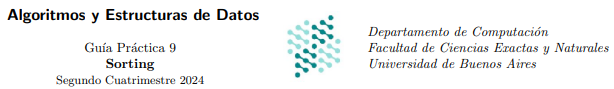
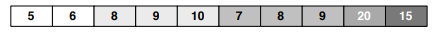
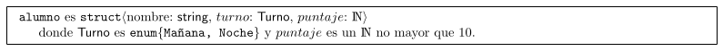

<p align="center">
  
</p>

<br>
<br>

<!--

# Sorting 
### Guia 8 
-->


**Ejercicio 1**. Comparar la complejidad de los algoritmos de ordenamiento dados en la teorica
para el caso en que el arreglo a ordenar se encuentre perfectamente ordenado de manera
inversa a la deseada.

<details><summary><b>💡 solucion</b></summary>
<hr>

Habria que usar un algoritmo __no-estable__, con la menor complejidad posible.
Se podria usar Quick-Sort por que es no-estable y su complejidad es O(n*n) en el peor caso.
Pero como sabemos que estan ordenados de forma inversa, podemos saber donde esta la mediana,
por ende la complejidad cambia a su mejor caso que es O(n log n)

<hr>
</details>

**Ejercicio 2**. Defina la propiedad de estabilidad en un algoritmo de ordenamiento. Explique por que 
que el algoritmo de heapSort no es estable

<details><summary><b>💡 solucion</b></summary>
<hr>

La estabilidad en los algoritmos de ordenamiento significa que, cuando se aplica el algoritmo, 
dos elementos con el mismo valor mantienen su orden relativo en la secuencia. Esto es útil en 
la práctica para realizar ordenamientos con múltiples criterios sin perder el orden previamente establecido.

Por ejemplo, es posible ordenar una lista primero por un criterio secundario y luego
por un criterio principal. Gracias a la estabilidad, el orden final reflejará 
ambos criterios: el principal, y en caso de empate, el secundario. En cambio, si el algoritmo no es estable,
el ordenamiento previo podría perderse, dejando solo el orden del último criterio aplicado.

El heap mantiene el min o max en el tope, al reconstruir el heap podria perderse el orden relativo
de los elementos.

<hr>
</details>


**Ejercicio 3**. Imagine secuencias de naturales de la forma `s = Concatenar(s′, s′′)`, donde `s′` 
es una secuencia ordenada de naturales y  `s´´` es una secuencia de naturales elegidos al azar. 
¿Que metodo utilizarıa para ordenar s? 
Justificar. (Entiendase ques se encuentra ordenada de la manera deseada.)

<details><summary><b>📖 respuesta</b></summary>
<hr>

Uso MergeSort con una complejidad O(n log n), porque al estar ordenada s' nose
realiza ninguna operacion adicional, y se ordena s'' y luego se hace un merge (se concatena) con s'. 


__Complejidad__: `O(n^2)`

<hr>
</details>


**Ejercicio 4**. Escribir un algoritmo que encuentre los k elementos mas chicos de un arreglo de dimension n, donde k ≤ n.
¿Cual es su complejidad temporal? ¿A partir de que valor de k es ventajoso ordenar el arreglo entero primero?

<details><summary><b>💡 solucion</b></summary>
<hr>

```
encontrar_kelems_MasChivos(in s: int, k: int)
   // varias opciones
   array_ordenado = mergeSort(s) 
   // array_ordenado = heapSort(s)

   res = new Array(k)
   for(int i=0, i<k, i++)
       res[i] = array_ordenado[i]
   end for
   return res

```

sea __m__ la complejidad del algoritmo de ordenamiento elegido

__Complejidad__: O(k) + O(m)  = O(k) + O(n log n) = O (k + n log n) 

como el loop es O(k), para k >= n/2 ,resulta mas ventajoso, si k fuese n entonces la complejidad :
O(n) + O(n log n) = O (n log n)`

<hr>
</details>


**Ejercicio 5**. Se tiene un conjunto de n secuencias {s1, s2, . . . , sn} en donde cada $s_{i}$ (1 ≤ i ≤ n) es una secuencia ordenada de naturales. ¿Que metodo utilizaria para obtener un arreglo que contenga todos los elementos de la union de los $s_{i}$ ordenados.Describirlo. Justificar.

<details><summary><b>📖 respuesta</b></summary>
<hr>

Como cada $s_{i}$ esta ordenado sabemos $s_{i}[0]$ seran los elementos mas chicos
y los siguiente $s_{i}[1]$ asi hasta $s_{i}[n]$

1. Sacamos el primer elemento de $s_{i}$ y lo insertamos en un min-heap
2. Sacamos el minimo del min-heap
3. Insertamos la siguiente ronda de $s_{i}$ en el min-heap
4. Sacamos el minimo del min-heap y repetimos hasta que el min heap quede vacio

<hr>
</details>


**Ejercicio 6**. Se tiene un arreglo de n numeros naturales que se quiere ordenar por frecuencia, y en caso de igual frecuencia, por su valor. Por ejemplo, a partir del arreglo [1, 3, 1, 7, 2, 7, 1, 7, 3] se quiere obtener [1, 1, 1, 7, 7, 7, 3, 3, 2]. Describa un algoritmo que realice el ordenamiento descripto, utilizando las estructuras de datos intermedias que considere necesarias.
Calcule el orden de complejidad temporal del algoritmo propuesto.

<details><summary><b>💡 solucion</b></summary>
<hr>

__OrdenarPorFrecuencia__:

0. creo un diccionario res = dictAVL<valor, frecuencia>   // O(1)
1. recorro toda el array de entrada, en cada iteracion pregunto: // O(n log n)
     - si valor __esta__ en res, incremento su `frecuencia`             // O(log n)
     - si valor __no esta__ en res, lo defino con `frecuencia = 0`      // O(log n)
2. con un iterador, itero y convierto el res en un array de tuplas    // O(n log n)
3. Ordeno por segunda componente con mergeSort // O(n log n)
4. Ordeno por primera componente con mergeSort // O(n log n)  

__complejidad__: O(nlog n)

**nota**: No se puede usar counting sort , pues cada elem en principio no esta acotado.
usar counting-sort resultaria en crear un array de n posiciones.

<hr>
</details>


**Ejercicio 7**. Sea $A[1 . . . n]$ un arreglo que contiene n numeros naturales. Diremos que un rango de posiciones $[i . . . j]$, con $1 ≤ i ≤ j ≤ n$, contiene una escalera en A si valen las siguientes dos propiedades:
1. $(\forall k : N)(i ≤ k < j) \rightarrow (A[k + 1] = A[k] + 1)$ (esto es, los elementos no s´olo est´an ordenados en forma creciente, sino que ademas el siguiente vale exactamente uno m´as que el anterior).
2. Si $1 < i$ entonces $A[i] \neq A[i − 1] + 1$ y si $j < n$ entonces $A[j + 1] \neq A[j] + 1$ (la propiedad es maximal, es decir que el rango no puede extenderse sin que deje de ser una escalera seg´un el punto anterior).

Se puede verificar facilmente que cualquier arreglo puede ser descompuesto de manera unica como una secuencia de escaleras. Se pide escribir un algoritmo para reposicionar las escaleras del arreglo original, de modo que las mismas se presenten en orden decreciente de longitud y, para las de la misma longitud, se presenten ordenadas en forma creciente por el primer valor de la escalera

El resultado debe ser del mismo tipo de datos que el arreglo original. Calcule la complejidad temporal de la solucion propuesta, y justifique dicho calculo.

Por ejemplo, el siguiente arreglo

<p align="center">
  
</p>

deberia ser transformado a

<p align="center">
  
</p>

*Ayuda*: se aconseja comenzar el ejercicio con una clara descripci´on en castellano de la estrategia que propone para resolver
el problema.


<details><summary><b>💡 solucion</b></summary>
<hr>


__Algoritmo__:

0. creo un array de tuplas <primerValor, largoEscalera> , 
  el tamaño de dicho array en la cantidad de Escalera
1. iterar sobre el array de entrada
   - si es otra escalera:
     - agrego al array de tuplas <primerValor, largoEscalera>
     - actualizo primerValor, seteo largoEscalera = 0
   - si no es otra escalera:
     - incremento largoEscalera
2. ordenar con mergeSort() por primera componente
3. ordenar con mergeSort() por segunda componente
4. Crear un arreglo res con el mismo tamaño que el arreglo original 
5. Para cada tupla (primerValor, largoEscalera) en el arreglo ordenado escaleras:
   - Se asignan los valores de la escalera en el arreglo res, 
    empezando desde la posición indicada por el primerValor, y rellenando hasta el final
    de la escalera (según el largoEscalera).
         

__Complejidad__ = O(n log n)

```
OrdenarPorFrecuencia(in a: array<int>)

  // armar tuplas  O(n)

  arrEscaleras = new array( cantidadEscaleras() )  // 0(1) + O(n)
  primero = a[0], largo = 0
  k=0

  for (i=0; i < a.size; i++ )      // O(n)
    if a[i+1] == a[i]+1 
      largo ++
    else                         // O(1)
      arrEscaleras[k]= (primero, largo)  
      primero = a[largo+1]
      largo=0
      k++
  endfor    

  // ordenar tuplas  O(nlog n)
 
  mergeSort(arrEscaleras) // por primer componente     // O(n log n)
  mergeSort(arrEscaleras) // por segunda coomponente   // O(n log n)

  // recontruir array original ordenado     O(n)

  res = new array(a.size)
  indice = 0
  for (primero, largo) in  arrEscaleras           
    i = 0
    while i < largo                              
      res[indice] = primero + i
      i ++
      indice ++
    endwhile
  return res
```


__Porque reconstruir el array ordenado es O(n)__

Hay dos casos:
1. en el peor caso hay n escaleras lo que implica que el largo de cada escalera es 1
entonces el loop exterior es O(n) y el interior es O(1).
2. en el peor caso el largo de la escalera es n, lo que implica que hay solo una escalera.
entonces el loop exterior es O(1) y el interior es O(n)


__NOTA__: como la complejidad de mergeSort es (n log n), podria usar listaEnlazada o DicLOG en
lugar de arrays por todos lados.

<hr>
</details>


**Ejercicio 8**. Suponga que su objetivo es ordenar arreglos de naturales (sobre los que no se conoce nada en especial), y que cuenta con una implementacion de arboles AVL. ¿Se le ocurre alguna forma de aprovecharla? Conciba un algoritmo que llamaremos AVL Sort. ¿Cual es el mejor orden de complejidad que puede lograr?

*Ayuda*: deberia hallar un algoritmo que requiera tiempo O(n log d) en peor caso, donde n es la cantidad de elementos a ordenar y d es la cantidad de elementos distintos. Para inspirarse, piense en Heap Sort (no en los detalles puntuales, sino en la idea general de este ultimo).
Justifique por que su algoritmo cumple con lo pedido.


<details><summary><b>💡 solucion</b></summary>
<hr>

__ALGORITMO__
```
AVLsort(int A: array<int>)
  Avl = new avl()      // O(1)
  for i=0 ...Tam(A)     // O(n)
    Avl.agregar(A[i]) // (log n)
  endfor
  res= Avl.inorderAVL() // O(n)
  return res 
```

__Complejidad__: O(n log n)  
<hr>
</details>


**Ejercicio 9**. Se tienen dos arreglos de numeros naturales, `A[1..n]` y `B[1..m]`. Nada en especial se sabe de B, pero A tiene `n′` secuencias de numeros repetidos continuos (por ejemplo `A = [3333311118888877771145555], n′ = 7`). Se sabe ademas que `n′`es mucho mas chico que `n`. Se desea obtener un arreglo C de tamaño `n + m` que contenga los elementos de A y B, ordenados.

1. Escriba un algoritmo para obtener C que tenga complejidad temporal `O(n + ( n′ + m ) log(n′ + m))` en el peor caso.
Justifique la complejidad de su algoritmo.

2. Suponiendo que todos los elementos de B se encuentran en A, escriba un algoritmo para obtener C que tenga complejidad temporal `O(n + n′(log(n′) + m))` en el peor caso y que utilice solamente arreglos como estructuras auxiliares.
Justifique la complejidad de su algoritmo.

<details><summary><b>💊 solucion</b></summary>


new d = new dictLog<valor, longitud> // O(1)


rep = 0
for i=1 ... tam(A)  // O(n)
  if A[i-1] != A[i]
    rep ++
  else
    definirRapido(d,A[i-1], rep) 
    rep = 0
end for

for i=1 ... tam(B)  // O(n)
  if B[i-1] != B[i]
    rep ++
  else
    definirRapido(d,B[i-1], rep) 
    rep = 0
end for


1.
```
def merge_arrays(A, B):
    # Paso 1: Agrupar secuencias de A
    agrupadas_A = []
    start = 0
    for i in range(1, len(A)):
        if A[i] != A[start]:
            agrupadas_A.append((A[start], i - start))  # (valor, longitud)
            start = i
    agrupadas_A.append((A[start], len(A) - start))  # Última secuencia

    # Paso 2: Construir un arreglo temporal con las secuencias agrupadas y B
    temporal = [val for val, _ in agrupadas_A] + B

    # Paso 3: Ordenar el arreglo temporal
    temporal.sort()

    # Paso 4: Reconstruir el arreglo C ordenado
    C = []
    for val, count in agrupadas_A:
        C.extend([val] * count)  # Expandir las secuencias originales de A
    C.extend(B)
    C.sort()
    return C
```


</details>


**Ejercicio 10**. Considere la siguiente estructura para guardar las notas de un alumno de un curso:


<p align="center">
  
</p>

Se necesita ordenar un arreglo de alumnos de forma tal que todes les alumnes de la mañana aparezcan al inicio de la tabla según un orden creciente de notas y todos los de la noche aparezcan al final de la tabla también ordenados de manera creciente respecto de su puntaje, como muestra en el siguiente ejemplo:

<p align="center">
  
</p>


1. Proponer un algoritmo de ordenamiento proc ordenaPlanilla(inout p : Array⟨alumno⟩) para resolver el problema descripto anteriormente y cuya complejidad temporal sea O(n) en el peor caso, donde n es la cantidad de elementos del arreglo. Justificar.

<details><summary><b>💡 solucion</b></summary>
<hr>

ordenar = new array(p.size)

mitad = 0
for i...tam(p)     // O(n)

  if p[i].turno == mañana
    ordenar[i] = p[i]
    mitad = i  
  else
    ordenar[tam(p)-i] = p[i] 
endfor

mañana = new array(mitad)
noche = new array(tam(p)-mitad)

for i...tam(mañana)
  mañana[i] = ordenar[i]
endfor
 
for i...tam(noche)
  noche[i] = ordenar[mitad+i]
endfor

countingSort(tarde, 11)         // O(n)
countingSort(noche, 11)         // O(n) 

for i ....tam(tarde):
    p[i] = tarde[i]

for i ...tam(noche):
  p[tam(tarde) + i] = noche[i]


__Complejidad__: O(n)


<hr>
</details>

2. Modificar la solución del inciso anterior para funcionar en el caso que Turno sea un tipo enumerado con más elementos (donde la cantidad de los mismos sigue estando acotada y el órden final está dado por el órden de los valores en el enum. Puedo hacer for t in Turno).

3. ¿La cota O(n) contradice el “lower bound” sobre la complejidad temporal en el peor caso de los algoritmos de ordenamiento? (El Teorema de “lower bound” establece que todo algoritmo general de ordenamiento tiene complejidad temporal Ω(n log n).) Explique su respuesta.


**Ejercicio 11**. Sea A[1 . . . n] un arreglo de números naturales en rango (cada elemento está en el rango de 1 a k, siendo k alguna constante). Diseñe un algoritmo que ordene esta clase de arreglos en tiempo O(n). Demuestre que la cota temporal es correcta

<details><summary><b>💡 solucion</b></summary>
<hr>


<hr>
<details>